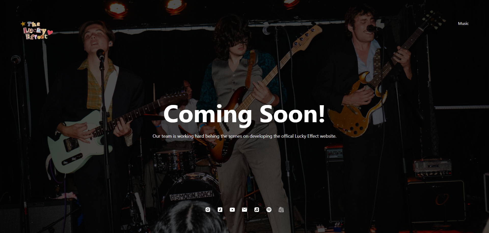
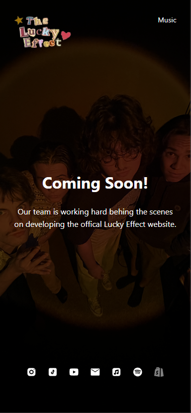

# The Lucky Effect | Official Website

Band website built with Next.js, designed to showcase The Lucky Effect’s music, videos, tour dates, and more. This project will connect to major platforms like Spotify, YouTube, and Bandsintown to provide fans with real-time updates, rich media, and a seamless experience. Built for both audiences and industry professionals.


## Badges

[](https://figma.com/)
[](https://nextjs.org/)
[](https://vercel.com/)
[](https://choosealicense.com/licenses/mit/)


## Features

- Live previews via [Vercel](https://vercel.com/)
- Fully responsive and mobile-first


## Tech Stack

**Frontend:** Next.js, React, TailwindCSS

**Deployment:** Vercel

**APIs:**

- Spotify Web API – stream music and show album details

- YouTube Data API – watch music videos

- Bandsintown API – live tour data

- Mailchimp – email marketing integration


## Environment Variables

To run this project, you will need to add the following environment variables to your .env file

`SPOTIFY_CLIENT_ID`

`SPOTIFY_CLIENT_SECRET`

`YOUTUBE_API_KEY`

`BANDSINTOWN_APP_ID`

`EMAIL_API_KEY`


## Installation

Install my-project with npm

```bash
  git clone https://github.com/kaitnrice/web-tle.git
  cd web-tle
  npm install
```

<!-- You can start editing the page by modifying `app/page.tsx`. The page auto-updates as you edit the file.

This project uses [`next/font`](https://nextjs.org/docs/app/building-your-application/optimizing/fonts) to automatically optimize and load [Geist](https://vercel.com/font), a new font family for Vercel. -->
    
## Run Locally

```bash
  npm run dev
  # or
  yarn dev
```

Visit [http://localhost:3000](http://localhost:3000) to view.


## Running Tests

```bash
  npm run test
```


## Deployment

To deploy this project run

```bash
  npm run deploy
```

on main repository


### Using Vercel

The easiest way to deploy a Next.js app is to use the [Vercel Platform](https://vercel.com/new?utm_medium=default-template&filter=next.js&utm_source=create-next-app&utm_campaign=create-next-app-readme) from the creators of Next.js.

Check out [Next.js deployment documentation](https://nextjs.org/docs/app/building-your-application/deploying) for more details.


## Color Reference

| Color             | Hex                                                                |
| ----------------- | ------------------------------------------------------------------ |
| Navy | #0a192f |
| White | #f8f8f8 |
| Teal | #00b48a |
| Teal (light) | #00d1a0 |


## Screenshots





## Roadmap

- Light/dark mode toggle

- Embedded Spotify music player

- Latest YouTube videos

- Real-time tour dates

- Mailing list signup

- Fast performance and SEO ready

- Add Shopify merch store

- Enable blog

- Expand SEO

- Analytics with Google Analytics


## Goal Optimizations

- Pre-rendered with static generation (SSG) for performance

- Lazy-loaded media content

- Accessibility improvements (ARIA, alt text, contrast)


## License

[MIT](https://choosealicense.com/licenses/mit/)


## Lessons Learned

This project enhanced my skills in API integration, SEO optimization, and deployment workflows. I gained experience structuring scalable content sites in Next.js and balancing creative brand expression with performance and accessibility.


## Acknowledgements

[Next.js Documentation](https://nextjs.org/docs)

[Tailwind CSS](https://tailwindcss.com/)

[Spotify for Developers](https://developer.spotify.com/)

[YouTube Data API](https://developers.google.com/youtube/v3)

[Bandsintown Artist API](https://artists.bandsintown.com/support/api-docs)

